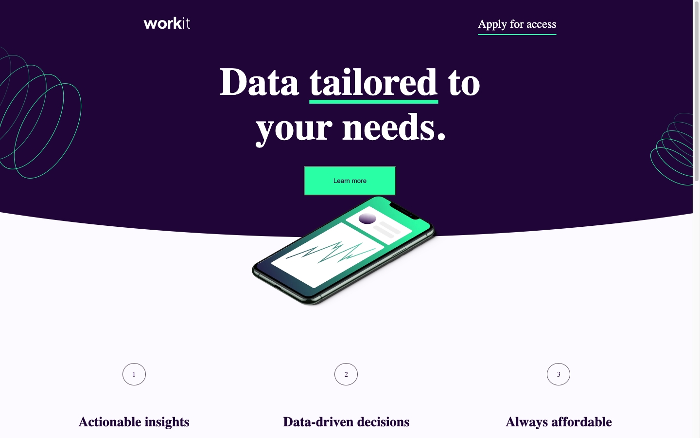

# Frontend Mentor - Workit landing page solution

This is a solution to the [Workit landing page challenge on Frontend Mentor](https://www.frontendmentor.io/challenges/workit-landing-page-2fYnyle5lu). Frontend Mentor challenges help you improve your coding skills by building realistic projects.

## Table of contents

- [Overview](#overview)
  - [Screenshot](#screenshot)
  - [Links](#links)
  - [Built with](#built-with)
  - [What I learned](#what-i-learned)
  - [Continued development](#continued-development)
  - [Useful resources](#useful-resources)
- [Author](#author)

## Overview

A Landing page for a company named Workit built with HTML and CSS.

### Screenshot

### Links

- Solution URL: https://www.frontendmentor.io/solutions/responsive-landing-page-using-css-flexbox-EvGdqKkGqN
- Live Site URL: https://workit-taupe.vercel.app/
- GitHub Repo: https://github.com/ZounMedia/workit

## My process

### Built with

- Semantic HTML5 markup
- CSS custom properties
- Flexbox
- Mobile-first workflow

### What I learned

I learned how to create a landing page using HTML and CSS. I learned about the clip-path css property for adding cool shapes to the bottom of sections.

### Continued development

I would like to focus on my project setup for future projects. Regular css is ok for small projects like this one, but I will use SASS for larger HTML/CSS projects.

### Useful resources

- https://bennettfeely.com/clippy/ - Clip-path generator for the rounded bottomes for each section

## Author

- Frontend Mentor - https://www.frontendmentor.io/profile/@rzounlom
